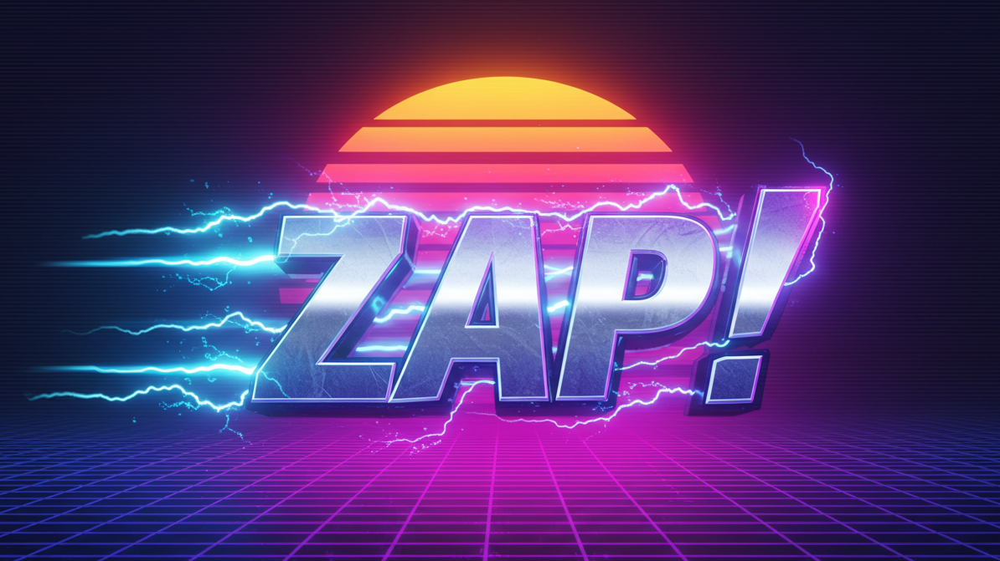

<p align="center">
  
</p>

# Zap! ⚡

> An AI-powered task management tool that supercharges your Google Tasks with Gemini AI

Zap! seamlessly integrates Google Tasks with Google's Gemini AI to help you manage your tasks more efficiently. It automatically prioritizes your tasks and creates intelligent subtasks, making project management smarter and more organized.

## ✨ Features

- 🤖 **AI-Powered Task Analysis**: Leverages Google's Gemini AI to understand and organize your tasks
- 📊 **Smart Task Prioritization**: Automatically prioritizes tasks in your Backlog and In Progress lists
- 🔄 **Intelligent Subtask Generation**: Creates meaningful subtasks for complex tasks automatically
- 🔐 **Secure Authentication**: Uses Google service account for secure access to your tasks
- 📋 **Multi-List Support**: Works with multiple task lists including Backlog and In Progress

## 🚀 Getting Started

### Prerequisites

- Google Cloud Project with Tasks API enabled
- Gemini API key
- Service account credentials

### Installation

#### Option 1: Download the Binary: 
1. Download the binary from the [releases page](https://github.com/masonbrott/zap/releases)
2. Run the binary:
   ```bash
   ./zap -u your.email@gmail.com
   ```
3. Set up your credentials:
  - Place your `credentials.json` (Google service account) in the zap directory
  - Set your Gemini API key as an environment variable:
    ```bash
    export GEMINI_API_KEY='your-api-key'
    ```

#### Option 2: Install from Source
1. Clone the repository:
   ```bash
   git clone https://github.com/masonbrott/zap.git
   cd zap
   ```

2. Install dependencies:
   ```bash
   go mod download
   ```

3. Set up your credentials:
   - Place your `credentials.json` (Google service account) in the zap directory
   - Set your Gemini API key as an environment variable:
     ```bash
     export GEMINI_API_KEY='your-api-key'
     ```

### Usage

Run Zap! with your Google account email:

```bash
go run main.go -u your.email@gmail.com
```

Zap! will:
1. Analyze and prioritize tasks in your Backlog and In Progress lists
2. Generate intelligent subtasks for complex tasks
3. Display a summary of changes made

## 🛠️ Configuration

- Modify target lists by updating the `targetLists` slice in `main.go`
- Adjust Gemini AI model settings in the configuration

<br>

<p align="center">Made with ⚡</p>
